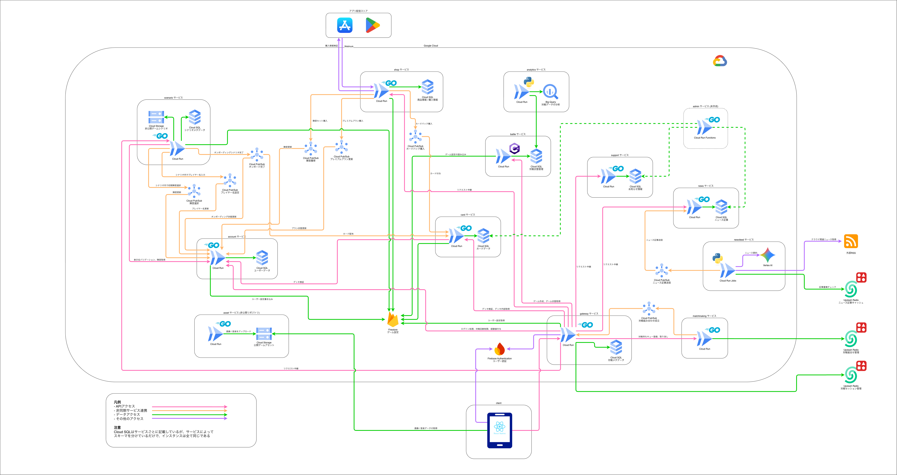

# overload-party-common

## Overload Party とは

Overload Party は、クラウドインフラをテーマにした対戦型デジタルカードゲーム。2 人のプレイヤーがリアルタイムで対戦し、相手の Budget を 0 以下にすることを目指す。

React (Capacitor) 製のモバイル / Web クライアントと、9 個のバックエンドサービス (Go 8 + C# 1、Google Cloud 上で稼働) で構成するマルチリポジトリのシステム。

## このリポジトリの役割

overload-party-common は、全リポジトリを横断する共有リソースの SSoT。

- **ゲームデザイン定数** (faction / card_type / restriction / zone 等) を YAML で管理し、Go / C# / npm の各パッケージとして配信する
- **アーキテクチャ・ゲームデザイン・ビジネスドキュメント**を一元管理する
- **Claude Code 開発ルールの overload-party 固有 overlay とリポジトリ・レジストリ**を管理する

## 関連リポジトリ

| リポジトリ | 役割 | 技術 |
|---|---|---|
| [gateway](https://github.com/kenyamaneko/overload-party-gateway) | 認証・WS hub・各ドメインサービスへのパススルー・集約 API (クライアント単一入口) | Go, Gin, gorilla/websocket |
| [account](https://github.com/kenyamaneko/overload-party-account) | ユーザー登録・設定・パスワードリセット | Go |
| [matchmaking](https://github.com/kenyamaneko/overload-party-matchmaking) | マッチキュー管理・マッチロジック・バトル引き渡し | Go |
| [shop](https://github.com/kenyamaneko/overload-party-shop) | 課金連携 (Apple / Google)・購入管理・Webhook 受信 | Go |
| [scenario](https://github.com/kenyamaneko/overload-party-scenario) | シナリオ解放判定・シナリオファイル配信 | Go |
| [card](https://github.com/kenyamaneko/overload-party-card) | カードマスターデータ管理・デッキバリデーション | Go |
| [battle](https://github.com/kenyamaneko/overload-party-battle) | 対戦ゲームエンジン | C# / .NET |
| [news](https://github.com/kenyamaneko/overload-party-news) | 収集記事の校閲・配信 | Go, HTMX |
| [support](https://github.com/kenyamaneko/overload-party-support) | お知らせ配信 | Go |
| [client](https://github.com/kenyamaneko/overload-party-client) | モバイル / Web フロントエンド | React, TypeScript, Capacitor |
| [infra](https://github.com/kenyamaneko/overload-party-infra) | Google Cloud リソース管理 | Terraform |
| [ops](https://github.com/kenyamaneko/overload-party-ops) | DB マイグレーション・監視ジョブ | Python, Cloud Run |
| [analytics](https://github.com/kenyamaneko/overload-party-analytics) | Spanner → BigQuery エクスポート | Go, Cloud Functions |
| [newsfeed](https://github.com/kenyamaneko/overload-party-newsfeed) | ニュース記事収集・要約 | Python, Vertex AI |
| [assets](https://github.com/kenyamaneko/overload-party-assets) | ゲームアセットパイプライン | GCS, Cloudflare CDN |
| [e2e](https://github.com/kenyamaneko/overload-party-e2e) | サービス横断の E2E テスト | TypeScript, Playwright |

## テスト観点カタログ

各リポのテスト名から生成した、テスト済みの観点の一覧。[kenyamaneko.github.io/overload-party-common](https://kenyamaneko.github.io/overload-party-common/)

## システム構成図

