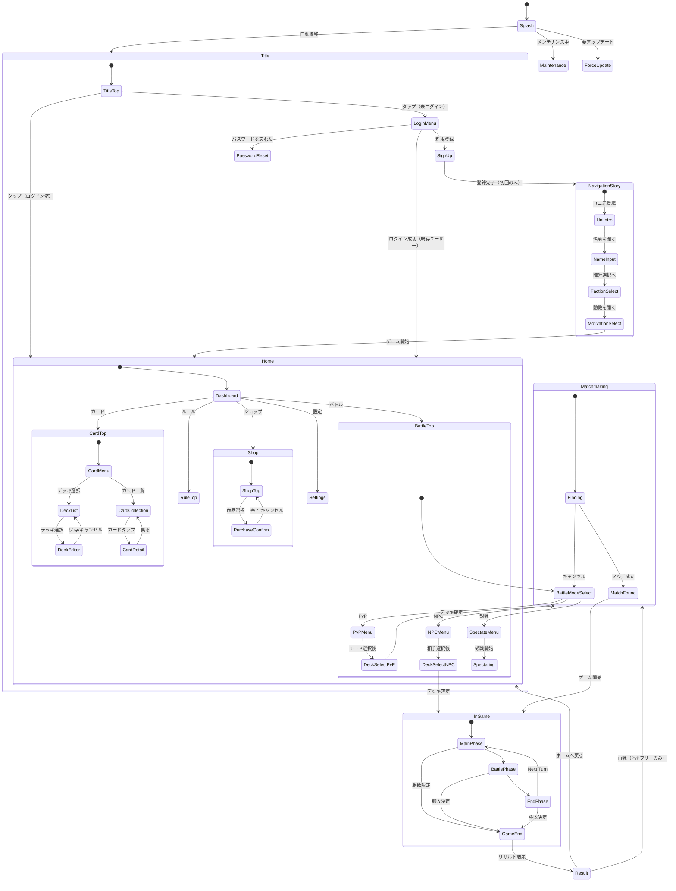

# Overload Party - UI デザイン設計書

**Version:** 3.0
**Last Updated:** 2026-02-24

---

## 目次

1. [画面遷移図](#1-画面遷移図-screen-flow)
2. [画面一覧](#2-画面一覧)
3. [画面詳細設計](#3-画面詳細設計)

---

## 1. 画面遷移図 (Screen Flow)



---

## 2. 画面一覧

| # | 画面名 | 画面ID | 備考 |
|---|--------|--------|------|
| 0 | スプラッシュ画面 | Splash | バージョンチェック・メンテ判定 |
| 0a | メンテナンス画面 | Maintenance | メンテナンス中の告知 |
| 0b | 強制アップデート画面 | ForceUpdate | ストアへ誘導 |
| 1 | タイトル画面 | Title | ログイン/サインアップ |
| 2 | サインアップ画面 | SignUp | 新規ユーザー登録 |
| 3 | パスワードリセット画面 | PasswordReset | メールアドレス入力 |
| 4 | ナビゲーションストーリー | NavigationStory | 初回ログイン時（ユニ君導入 → 名前入力 → 陣営選択 → 動機選択） |
| 5 | ホーム画面（TOP） | Home | メインハブ |
| 6 | バトルTOP画面 | BattleTop | PvP/NPC/観戦 |
| 7 | デッキ選択画面（バトル前） | DeckSelect | バトル前のデッキ選択 |
| 8 | マッチング待機画面 | Matchmaking | PvPマッチング中 |
| 9 | バトルフィールド画面 | InGame | ゲーム本体 |
| 11 | バトル結果画面 | Result | 勝敗・報酬・リプレイ |
| 12 | カードTOP画面 | CardTop | デッキ/カード一覧 |
| 13 | デッキ一覧画面 | DeckList | 作成済みデッキ |
| 14 | デッキ編集画面 | DeckEditor | デッキの作成・編集 |
| 15 | カード一覧画面 | CardCollection | 全カード閲覧 |
| 16 | カード詳細画面 | CardDetail | カード情報の拡大表示 |
| 17 | ルールTOP画面 | RuleTop | ルールブック/チュートリアル |
| 18 | ショップ画面 | Shop | 課金・購入 |
| 19 | 設定画面 | Settings | アカウント・環境設定 |

---

## 3. 画面詳細設計

### 0. スプラッシュ画面 (Splash)

**目的:** アプリ起動時の初期処理

**処理フロー:**
```
アプリ起動
    │
    ▼
サーバー状態チェック（API: /api/v1/health）
    │
    ├── メンテナンス中 → メンテナンス画面
    │
    ▼
クライアントバージョンチェック
    │
    ├── 強制アップデート必要 → 強制アップデート画面
    │
    ▼
タイトル画面へ自動遷移
```

**表示要素:**
- ゲームロゴ
- ローディングインジケータ

---

### 0a. メンテナンス画面 (Maintenance)

**表示要素:**
- メンテナンス中メッセージ
- メンテナンス終了予定時刻（サーバーから取得）
- 「リトライ」ボタン

---

### 0b. 強制アップデート画面 (ForceUpdate)

**表示要素:**
- アップデート案内メッセージ
- 「ストアを開く」ボタン（App Store / Google Play へ遷移）

---

### 1. タイトル画面 (Title)

**機能:**
- ユーザー認証（Google Sign-In / Email+Password）
- ログイン状態に応じた分岐

**表示要素:**
- ゲームロゴ
- 「TAP TO START」
- バージョン情報

**遷移:**

| 条件 | タップ時の挙動 |
|------|---------------|
| ログイン済み | ホーム画面へ遷移 |
| 未ログイン | ログイン/サインアップメニューを表示 |

**ログイン/サインアップメニュー（オーバーレイ）:**

| ボタン | 遷移先 |
|--------|--------|
| Googleでログイン | Firebase Google Sign-In → ホーム画面 |
| メールアドレスでログイン | メール+パスワード入力フォーム → ホーム画面 |
| 新規登録 | サインアップ画面 |
| パスワードを忘れた方はこちら | パスワードリセット画面 |

---

### 2. サインアップ画面 (SignUp)

**入力項目:**

| 項目 | 必須 | バリデーション |
|------|:----:|---------------|
| ニックネーム | ○ | 1〜16文字 |
| メールアドレス | ○ | メール形式 |
| パスワード | ○ | 8文字以上、英数混合 |
| 利用規約への同意 | ○ | チェック必須 |

**ボタン:**
- 「登録する」→ Firebase Auth で登録 → 陣営選択画面へ遷移
- 利用規約リンク（外部ブラウザ / WebView）

---

### 3. パスワードリセット画面 (PasswordReset)

**入力項目:**

| 項目 | 必須 | バリデーション |
|------|:----:|---------------|
| メールアドレス | ○ | メール形式 |

**ボタン:**
- 「送信する」→ Firebase Auth でリセットメール送信
- 送信完了メッセージ表示 → タイトル画面へ戻る

---

### 4. ナビゲーションストーリー (NavigationStory)

**目的:** 初回ログイン時にナビゲーションキャラ「ユニ君」が世界観を紹介し、プレイヤー名入力・陣営選択・動機選択を行う

> 詳細なスクリプトは [STORY.md](STORY.md) を参照

**フロー:**
```
サインアップ完了
    │
    ▼
ユニ君登場 — 世界観の説明（AIノイズに侵食されたデジタル・ライフ）
    │
    ▼
プレイヤー名入力（識別子）
    │                                    ┌───────────────────────────────────┐
    ▼                                    │ バリデーション                      │
名前確認                                  │ - 1〜16文字                       │
    │                                    │ - API: POST /api/v1/players/name  │
    ▼                                    └───────────────────────────────────┘
陣営（ユニット）選択 — ユニ君が4陣営を紹介
    │
    ├── SWS: 物流の熱量で世界を繋ぎ止めようとする者
    ├── Aozora: 天候の障壁で平穏を守り抜こうとする者
    ├── Guruguru: 創造の遊び心で絶望を塗り替えようとする者
    └── Miracle: 完璧な調律で魂を震わせようとする者
    │
    ▼
確認ポップアップ「〇〇を選びますか？（あとから変更できません）」
    │
    ├── キャンセル → 選択画面に戻る
    │
    └── 決定 → API: POST /api/v1/players/select-faction
              → 選択陣営 + Neutral の全カードを PlayerCards に INSERT
    │
    ▼
動機選択（3択）
    ├── クラウドサービスを学んで最高の設計力を身に付けたい
    ├── カードゲームで楽しい時間を過ごしたい
    └── 可愛いキャラと交流したい
    │
    ▼
ホーム画面へ遷移

> OPムービーはMVP外。将来的にナビゲーション末尾に挿入予定。
```

**ユニ君について:**
- キュウべえのような語り口のナビゲーションキャラ
- 今後は「今日のひとこと」やTips配信でも登場予定

---

### 5. ホーム画面 / スタート画面 (Home)

**機能:** ゲームのメインハブ

**レイアウト:**

```
┌──────────────────────────────────────────┐
│  [アイコン] ニックネーム     Lv.12       │ ← ヘッダー
│  残りバトル: 7/10                        │
├──────────────────────────────────────────┤
│                                          │
│         ┌──────────────┐                 │
│         │              │                 │
│         │  メインキャラ  │                 │
│         │    画像       │                 │
│         │              │                 │
│         └──────────────┘                 │
│                                          │
│  「今日のひとこと」                        │
│  ─────────────────────                   │
│  お知らせバナー（スクロール）               │
│                                          │
├──────────────────────────────────────────┤
│ [バトル] [カード] [ルール] [ショップ] [設定]│ ← フッターナビ
└──────────────────────────────────────────┘
```

**ヘッダー情報:**

| 項目 | 取得元 | 備考 |
|------|--------|------|
| ニックネーム | Players.display_name | |
| レベル | Players.level | |
| 残りバトル回数 | PlayerDailyBattle | 無課金: x/10、プレミアム: 無制限 |
| アイコン | Players.equipped_icon_no | コレクションアイテム |

**メインキャラ画像:** 選択中の陣営の代表キャラ（将来的にカスタマイズ可能）

**今日のひとこと:** サーバーから配信するテキスト（※新規要素。API: GET /api/v1/tips/daily）

**お知らせ:** サーバーから配信（API: GET /api/v1/announcements）

**フッターナビゲーション:**

| ボタン | 遷移先 |
|--------|--------|
| バトル | バトルTOP画面 |
| カード | カードTOP画面 |
| ルール | ルールTOP画面 |
| ショップ | ショップ画面 |
| 設定 | 設定画面 |

---

### 6. バトルTOP画面 (BattleTop)

**モード選択メニュー:**

| ボタン | 説明 |
|--------|------|
| PvP | オンライン対人戦 |
| NPC | AI対戦 |
| 観戦する | 他プレイヤーの試合を観る |

**PvPサブメニュー:**

| ボタン | 説明 | 遷移先 |
|--------|------|--------|
| ランダムマッチ | ランダムな相手とマッチ | デッキ選択画面 |
| キーコードで対戦 | キーコード入力でフレンド対戦 | キーコード入力 → デッキ選択画面 |

**NPCサブメニュー:**

| ボタン | 説明 | 遷移先 |
|--------|------|--------|
| 相手を選択する | NPC陣営を選ぶ | NPC選択リスト → デッキ選択画面 |

**NPC選択リスト:**
- SWS / Aozora / Guruguru / Miracle の4陣営から選択
- 各陣営に難易度（Easy / Normal / Hard）があるとなお良い（将来拡張）

**観戦サブメニュー:**

| ボタン | 説明 | 遷移先 |
|--------|------|--------|
| ランダム観戦 | 進行中の試合をランダムに観戦 | バトルフィールド（観戦モード） |
| キーコードで観戦 | 特定の試合を観戦 | キーコード入力 → バトルフィールド |

---

### 7. デッキ選択画面 — バトル前 (DeckSelect)

**目的:** バトル開始前に使用するデッキを選ぶ

**表示要素:**
- 作成済みデッキ一覧（最大10個）
- デッキごとの情報: デッキ名、陣営アイコン、カード枚数
- is_valid = false のデッキは選択不可（グレーアウト + 「デッキが不完全です」表示）

**フロー:**
```
デッキをタップ → 「このデッキで対戦しますか？」確認
    │
    ├── キャンセル → デッキ選択画面に戻る
    │
    └── 決定 → PvP: マッチング待機画面へ
              NPC: バトルフィールド画面へ（即座に開始）
```

---

### 8. マッチング待機画面 (Matchmaking)

**目的:** PvPマッチング中の待機

**表示要素:**
- マッチング中アニメーション
- 経過時間表示
- 選択中のデッキ情報
- 「キャンセル」ボタン

**フロー:**
```
マッチング開始（WebSocket: join_queue）
    │
    ├── マッチ成立 → 対戦相手情報を表示（名前・レベル）→ バトルフィールド画面へ
    │
    ├── タイムアウト（60秒） → 「対戦相手が見つかりません」→ バトルTOP画面へ
    │
    └── キャンセル → バトルTOP画面へ
```

---

### 9. バトルフィールド画面 (InGame)

> マリガン（手札交換）は廃止。スターティングリソース選択があるため手札事故のリスクが低い。

**全体レイアウト:**

```
┌──────────────────────────────────────────┐
│  相手名  Lv.12  Budget:2000  DV:800     │ ← 相手情報
│  手札:4枚  リポジトリ:18枚  トラッシュ:3  │
├──────────────────────────────────────────┤
│                                          │
│  [相手バックエンド]  [ ][ ][ ] + サポート │
│  [相手フロントエンド] [ ][ ][ ]           │
│  ──────────────────────────────────────  │
│  [自分フロントエンド] [ ][ ][ ]           │
│  [自分バックエンド]  [ ][ ][ ] + サポート │
│                                          │
├──────────────────────────────────────────┤
│  Budget:1500  DV:600  リポジトリ:15枚     │ ← 自分情報
│  フェーズ: [Main]  [ターン終了]           │
│                                          │
│  [ 手札カード ] [ ] [ ] [ ] [ ]          │ ← 手札エリア
│                                          │
│  [スタンプ]                    [メニュー] │
└──────────────────────────────────────────┘
```

**表示項目:**

| 項目 | 自分 | 相手 |
|------|:----:|:----:|
| 名前・レベル | ○ | ○ |
| Budget（予算） | ○ | ○ |
| Data Value（DV） | ○ | ○ |
| フィールドカード（Front 3枠 + Back 3枠） | ○ | ○ |
| サポートゾーン | ○ | ○ |
| 手札 | 表向き | 枚数のみ |
| リポジトリ残数 | ○ | ○ |
| トラッシュ枚数 | ○ | ○ |

**HUD / 操作系:**
- **フェーズインジケータ:** Draw / Main / Battle / End
- **ターン終了ボタン**
- **スタンプパレットボタン:** タップでスタンプ一覧を展開
- **メニューボタン:** 降参、設定（SE/BGM）、切断対策

**アタッチメント表示:**

> 詳細は下記「アタッチメント表示仕様」を参照

#### 10.1 アタッチメント表示（サイドスタック + ゴーストスロット）

各リソースは最大2枚のアタッチメントスロットを持つ。フィールド上ではリソースカードの右側にアタッチメントがはみ出す形で表示する。

**フィールド表示（縮小カード状態）:**

```
装備 0/2:                 装備 1/2:                 装備 2/2:
┌──────────┐╌╌╌╌╌╌╌╌╌  ┌──────────┬───┐╌╌╌╌╌  ┌──────────┬───┬───┐
│          ╎    ╎    ╎  │          │   ╎    ╎  │          │   │   │
│ Resource ╎ 空 ╎ 空 ╎  │ Resource │ A ╎ 空 ╎  │ Resource │ A │ B │
│          ╎    ╎    ╎  │          │   ╎    ╎  │          │   │   │
└──────────┘╌╌╌╌╌╌╌╌╌  └──────────┴───┘╌╌╌╌╌  └──────────┴───┴───┘
ゴースト枠2つ            実カード1 + ゴースト1       全スロット使用済み
```

- **ゴーストスロット（空き枠）:** 破線の薄い枠で常に表示。「装備可能」であることを示す
- **装備済みスロット:** アタッチメントカードの枠部分（右辺）がはみ出して見える。カード名は読めなくてよい
- **全スロット使用時:** ゴースト枠が消え、「もう付けられない」ことが直感的にわかる

**タップ時（カード詳細表示）:**

リソースカードをタップすると、イラスト込みのフルカードが表示される。カード本体のレイアウトは変更しない。
装備中のアタッチメントカードは、リソースカードの右側にカード名が見える形（上辺+右辺が露出）で重ねて表示する。
未装備スロットはゴースト枠として同じ位置に表示する。

```
タップ時の詳細表示:

                          ┌─── Attachment A ──┐
┌─────────────────────┐───┤                   │
│                     │   │                   ├╌╌╌╌╌╌╌╌╌╌╌╌╌╌╌╌╌╌╌╌╌╌┐
│                     │   │                   ╎                        ╎
│    ＜イラスト＞      │   │                   ╎    空きスロット         ╎
│                     │   │                   ╎    (ゴースト枠)        ╎
│                     │   │                   ╎                        ╎
│  えくぼ              │   │                   ╎                        ╎
│  SWS Compute (R)    │   │                   ╎                        ╎
│  AV 1400  TP 700    │───┤                   ├╌╌╌╌╌╌╌╌╌╌╌╌╌╌╌╌╌╌╌╌╌╌┘
│  ...                │   └───────────────────┘
└─────────────────────┘
```

- リソースカードのフル表示（イラスト込み）はそのまま維持
- アタッチメントの上辺（カード名が見える）と右辺が露出
- アタッチメント部分をタップ → そのアタッチメントのフルカード表示へ遷移
- 空きスロットはゴースト枠（破線）で表示

---

### 11. バトル結果画面 (Result)

**表示要素:**

| 項目 | 説明 |
|------|------|
| 勝敗 | VICTORY / DEFEAT / DRAW を大きく表示 |
| 結果詳細 | ターン数、与えたダメージ合計、変換したデータ量 |
| 経験値獲得 | 獲得EXP表示 + EXPバー進捗アニメーション（レベルアップ時は演出あり） |

**ボタン:**

| ボタン | 条件 | 遷移先 |
|--------|------|--------|
| ホームへ戻る | 常時 | ホーム画面 |
| もう一度対戦する | PvPフリーマッチ / NPC戦のみ | マッチング待機画面 / バトルフィールド |
| リプレイを保存 | 常時 | リプレイをCloud Storageに保存 |

---

### 12. カードTOP画面 (CardTop)

**メニュー:**

| ボタン | 遷移先 |
|--------|--------|
| デッキ | デッキ一覧画面 |
| カード一覧 | カード一覧画面 |

---

### 13. デッキ一覧画面 (DeckList)

**表示要素:**
- 作成済みデッキのリスト表示（最大10個）
- デッキごとの情報: デッキ名、陣営、勝率、カード枚数
- 「新規作成」ボタン

**操作:**
- デッキをタップ → デッキ編集画面へ遷移

---

### 14. デッキ編集画面 (DeckEditor)

**モード:**
- **閲覧モード（デフォルト）:** カード構成を確認。編集操作不可
- **編集モード:** 「編集」ボタンで切替。カードの追加/削除が可能

**レイアウト:**

```
┌─────────────────────┬──────────────────────┐
│  カードプール         │  デッキ構成           │
│                     │                      │
│  [フィルター]        │  デッキ名: ＿＿＿     │
│  タイプ/コスト/陣営   │                      │
│  [検索バー]          │  カードリスト          │
│                     │  (xx / 30)           │
│  カード一覧          │                      │
│  (タップで追加)      │  コスト分布グラフ      │
│                     │                      │
│                     │  [保存] [キャンセル]   │
└─────────────────────┴──────────────────────┘
```

**カードプール（左側）:**
- フィルター機能（タイプ、コスト、陣営）
- 検索バー
- カードリスト（タップ / ドラッグでデッキに追加）
- 未所持カードはグレースケールで表示（追加不可）

**デッキ構成（右側）:**
- デッキ名入力
- 選択済みカードリスト（タップで取り除く）
- コスト分布グラフ
- 枚数インジケータ（xx / 30）
- プレイマット / スリーブ選択（コレクション装備）
- 「保存」「キャンセル」ボタン

**メニューボタン:**

| ボタン | 説明 |
|--------|------|
| 編集 | 編集モードへ切替 |
| 削除 | デッキを削除（確認ポップアップあり） |

**保存時のバリデーション:**

> 参照: [MONETIZATION.md §7 デッキ管理](MONETIZATION.md#7-デッキ管理)

```
枚数 = 30枚？ → No → エラー「30枚必要です」
    │ Yes
    ▼
全カード所持済み？ → No → エラー「未所持カードが含まれています」
    │ Yes
    ▼
陣営ルール適合？ → No → エラー「陣営ルール違反」
    │ Yes
    ▼
is_valid = true で保存
```

---

### 15. カード一覧画面 (CardCollection)

**目的:** 全カードの閲覧

**表示要素:**
- 全126枚のカードをグリッド表示
- 所持カード: 通常表示
- 未所持カード: グレースケール + 鍵アイコン
- フィルター: 陣営（SWS / Aozora / Guruguru / Miracle / Neutral）、タイプ、コスト
- ソート: カード番号順 / コスト順 / 陣営順

**操作:**
- カードをタップ → カード詳細画面へ遷移

---

### 16. カード詳細画面 (CardDetail)

**表示要素:**
- カードイラスト（フルサイズ）
- カード名
- 陣営 / タイプ / サブタイプ
- コスト
- AV（Attack Value）/ TP（Toughness Point）
- 効果テキスト
- フレーバーテキスト
- 所持状態（所持 / 未所持）
- イラスト違い切替（所持している場合）

**操作:**
- 左右スワイプで前後のカードへ移動
- 「閉じる」ボタン → カード一覧画面へ戻る

---

### 17. ルールTOP画面 (RuleTop)

**メニュー:**

| ボタン | 説明 | 遷移先 |
|--------|------|--------|
| ルールブック | ゲームルールの詳細 | 外部サイト（WebView） |
| チュートリアル | インタラクティブなチュートリアル | チュートリアルを開始 |

---

### 18. ショップ画面 (Shop)

**タブ構成:**

| タブ | 内容 |
|------|------|
| プレミアムプラン | サブスクリプション（バトル回数無制限） |
| カードセット | 陣営カードセット（買い切り） |
| コレクション | プレイマット / スリーブ / アイコン / 特別イラストカード |
| スタンプ | 陣営スタンプセット |

**プレミアムプランタブ:**

| 項目 | 説明 |
|------|------|
| プラン説明 | バトル回数無制限 |
| 価格 | 月額（App Store / Google Play 経由） |
| 登録ボタン | 各プラットフォームの決済UIを起動 |
| 現在の状態 | 未加入 / 加入中（次回更新日: YYYY-MM-DD） |

**カードセットタブ:**

| セット名 | 内容 | 状態 |
|---------|------|------|
| SWSセット | SWS陣営の全カード | 購入済み / 購入ボタン |
| Aozoraセット | Aozora陣営の全カード | 購入済み / 購入ボタン |
| Guruguruセット | Guruguru陣営の全カード | 購入済み / 購入ボタン |
| Miracleセット | Miracle陣営の全カード | 購入済み / 購入ボタン |

> 初期選択済みの陣営は「選択済み」として表示。Neutralは全員所持のため表示しない。

**コレクションタブ:**
- プレイマット一覧
- カードスリーブ一覧
- アイコン一覧
- 特別イラストカード一覧

**スタンプタブ:**
- 陣営スタンプセット（SWS / Aozora / Guruguru / Miracle: 各480円）

**購入確認ポップアップ:**
- 商品名、価格、説明
- 「購入する」「キャンセル」ボタン
- 購入完了後 → 完了メッセージ + 所持アイテムに反映

---

### 19. 設定画面 (Settings)

**メニュー:**

| 項目 | 説明 |
|------|------|
| ニックネームの変更 | 新しいニックネームを入力して保存 |
| パスワードの変更 | 現在のパスワード + 新しいパスワードを入力 |
| SE音量 | スライダー（0〜100） |
| BGM音量 | スライダー（0〜100） |
| プレミアムプラン管理 | 加入状態の確認。解約は各ストアの管理画面へ誘導 |
| このゲームについて | バージョン情報、クレジット |
| 利用規約 | 外部サイト（WebView） |
| プライバシーポリシー | 外部サイト（WebView） |
| お問い合わせ | 問い合わせフォーム / メーラー起動 |
| ログアウト | 確認ポップアップ → Firebase Auth サインアウト → タイトル画面 |
| アカウント削除 | 二重確認ポップアップ → アカウント削除 → タイトル画面 |

---

## 4. レベルシステム設計

### 4.1 経験値テーブル

**計算式:** レベル n に必要な累計EXP = `60 × n²`

| レベル | 累計EXP | 次レベルまで |
|--------|---------|-------------|
| 1 | 60 | 60 |
| 2 | 240 | 180 |
| 3 | 540 | 300 |
| 5 | 1,500 | 540 |
| 10 | 6,000 | 1,140 |
| 15 | 13,500 | 1,740 |
| 20 | 24,000 | 2,340 |
| 25 | 37,500 | 2,940 |
| 30 | 54,000 | 3,540 |
| 40 | 96,000 | 4,740 |
| 50 | 150,000 | 5,940 |
| 60 | 216,000 | 7,140 |

### 4.2 EXP獲得条件

| 条件 | 獲得EXP |
|------|---------|
| 勝利 | 40 |
| 敗北 | 20 |
| 引分 | 30 |

### 4.3 到達シミュレーション

| プレイヤータイプ | 日/対戦数 | 期間 | 総対戦数 | 総EXP(平均) | 到達レベル |
|---------------|----------|------|---------|-------------|-----------|
| カジュアル | 10 | 6ヶ月 | 1,800 | 54,000 | **30** |
| アクティブ | 10 | 1年 | 3,650 | 109,500 | ~42 |
| ヘビー | 15 | 1年 | 5,475 | 164,250 | ~52 |
| コア | 20 | 1年 | 7,300 | 219,000 | **~60** |

- レベル上限: **なし**（理論上無制限）
- EXPはPvP・NPC戦の両方で獲得可能

### 4.4 サーバー実装

- Players テーブルに `level` (INT64), `exp` (INT64) カラム追加
- バトル結果確定時に EXP を加算し、閾値を超えていればレベルアップ
- API: GET /api/v1/players/me でレベル・EXP情報を返却

---

## 5. 称号制度（MVP外）

### 5.1 レベル称号

| 条件 | 称号 |
|------|------|
| レベル10到達 | プラクティショナー |
| レベル20到達 | アソシエイトアーキテクト |
| レベル30到達 | プロフェッショナルアーキテクト |

### 5.2 実績称号（未定）

| 条件 | 称号 |
|------|------|
| 通算100勝 | （未定） |
| 特定陣営で100回対戦 | （未定） |

### 5.3 サーバー実装メモ

- PlayerTitles テーブル（player_id, title_id, acquired_at）
- TitleDefinitions テーブル（title_id, title_name, condition_type, condition_value）
- Players テーブルに `equipped_title_id` カラム追加

---

## 補足: 新規要素のサーバー実装ステータス

| 要素 | 実装方針 | ステータス |
|------|---------|-----------|
| レベルシステム | Players テーブルに `level`, `exp` カラム追加。累計EXP = 60n² の閾値設計（§4参照） | MVP |
| 初回ナビゲーション | サインアップ後にユニ君のストーリー導入。名前入力→陣営選択→動機選択 | MVP |
| OPムービー | ナビゲーション末尾に挿入するオープニングムービー | **MVP外** |
| 今日のひとこと | ユニ君がIT/クラウド関連ニュースをつぶやく。初期はAI生成+人間承認、後に完全自動化 | **MVP外** |
| メンテナンスチェック | `/api/v1/health` のレスポンスに `maintenance`, `maintenance_message`, `estimated_end_time` フィールドを追加 | MVP |
| バージョンチェック | `/api/v1/version` で最小要求バージョンを返す | MVP |
| リプレイ保存 | Cloud Storage への保存 API（ARCHITECTURE.md に記載済み） | MVP |
| 称号制度 | レベル称号 + 実績称号（§5参照） | **MVP外** |
