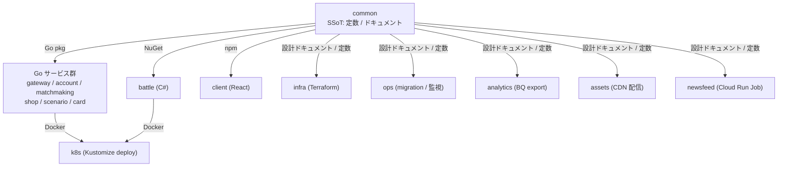
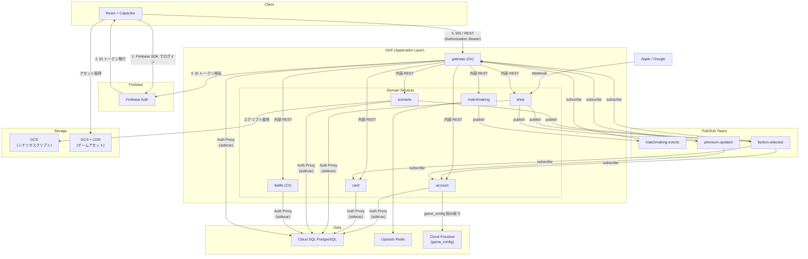

# システム全体設計

---

## 目次

1. [概要](#1-概要)
2. [プロジェクト構成](#2-プロジェクト構成multi-repo)
3. [技術スタック](#3-技術スタック)
4. [システムアーキテクチャ](#4-システムアーキテクチャ)

関連ドキュメント: [APPLICATION.md](APPLICATION.md) / [INFRASTRUCTURE.md](INFRASTRUCTURE.md) / [DATA_DESIGN.md](DATA_DESIGN.md)

---

## 1. 概要

### 1.1 プロジェクト概要

Overload Partyは、クラウドインフラをテーマにした対戦型デジタルカードゲームです。2人のプレイヤーがリアルタイムで対戦し、相手のBudgetを0以下にすることを目指します。

### 1.2 主要要件

- **リアルタイム対戦**: 2人のプレイヤーが同時にプレイ
- **複雑な状態管理**: チェーンシステム、継続効果
- **強整合性**: ゲーム状態の厳密な管理
- **低レイテンシ**: 快適なゲーム体験
- **スケーラビリティ**: 多数の同時対戦に対応
- **クロスプラットフォーム**: iOS/Android対応

### 1.3 非機能要件

| 要件 | 目標値 |
|------|--------|
| レスポンスタイム | < 100ms (P95) |
| 同時接続数 | 10,000+ |
| 可用性 | 99.9% |
| データ整合性 | 100% |

---

## 2. プロジェクト構成（Multi-repo）

Overload Party は複数の独立した Git リポジトリで構成される。`overload-party-common` がゲームデザイン・カードデータ・ドキュメントの Single Source of Truth（SSoT）となり、コード生成パイプラインで各リポに成果物を配布する。

バックエンドは 7 つのサービス（gateway / account / matchmaking / shop / scenario / card / battle）で構成され、Gateway 以外はすべて Go 1.25、Battle のみ C# / .NET 10 である。Gateway は WS 通信ハンドリング・認証検証・ルーティングに専念し、ドメインロジックは各サービスに閉じる。ドメインごとに独立したリポジトリ・デプロイ単位を持たせることで、変更リスクと責務を局所化する。

### 2.1 リポジトリ一覧

| リポジトリ | 役割 | 技術 | CI |
|-----------|------|------|-----|
| **common** | ゲーム設計・カードデータ・ドキュメント（SSoT） | YAML, Python, Markdown | DB マイグレーション自動適用 |
| **gateway** | WS 通信ハンドリング・認証検証・ルーティング（クライアント単一入口） | Go 1.25, Gin, gorilla/websocket | lint → test → Docker push |
| **account** | ユーザー登録・設定・パスワードリセット | Go 1.25 | lint → test → Docker push |
| **matchmaking** | マッチキュー管理・マッチロジック・バトル引き渡し | Go 1.25 | lint → test → Docker push |
| **shop** | 課金連携 (Apple/Google)・購入管理・フラグ付与・Webhook 受信 | Go 1.25 | lint → test → Docker push |
| **scenario** | シナリオ解放判定・シナリオファイル配信 | Go 1.25 | lint → test → Docker push |
| **card** | カードマスターデータ管理・デッキバリデーション・カード一覧 | Go 1.25 | lint → test → Docker push |
| **battle** | 対戦ゲームエンジン | C# / .NET 10 | test → Docker push |
| **client** | モバイル/Web フロントエンド | React 19, TypeScript, Vite, Capacitor | lint → typecheck → test |
| **infra** | Google Cloud リソース管理 | Terraform | plan → apply（パス変更時のみ） |
| **k8s** | GKE デプロイ・運用 | Kustomize, GitHub Actions | deploy / startup / shutdown / scale |
| **ops** | DB マイグレーション・監視ジョブ・Slack コマンド | Docker, Cloud Run, Cloudflare Workers, Python | CI + 手動 dispatch |
| **analytics** | Spanner → BigQuery エクスポート | Go, Cloud Functions | 手動デプロイ |
| **newsfeed** | ニュースフィード生成 | Python, Vertex AI | 手動デプロイ |
| **assets** | ゲームアセットパイプライン（イラスト・スタンプ・SE 等の管理・配信） | GCS, Cloudflare CDN | CI でマニフェスト生成 |
| **web** | ティザーサイト（未作成） | — | — |

**サービス間通信:** Gateway 以外のサービス（account / matchmaking / shop / scenario / card / battle）はクラスタ内ネットワークに閉じ、原則 Gateway からの内部 REST 経由でのみ到達可能とする。唯一の例外は shop サービスの Webhook 受信エンドポイントで、Apple / Google の課金サーバーからのサーバー間通知を受けるために外部公開する（詳細は 8.6 参照）。

### 2.2 コード生成パイプライン

各リポが `data/models.yaml` を SSoT として型定義を持ち、`scripts/generate_types.py` で Go / C# / TS パッケージを生成する。ドキュメント生成（DATA_DESIGN.md, API_REFERENCE.md）は common の `packages/doc-tools` パッケージが提供する。main への push 時に CI が自動で publish する。詳細は各リポの README を参照。

### 2.3 リポジトリ間の依存グラフ




---

## 3. 技術スタック

### 3.1 フロントエンド

```
React + Capacitor (TypeScript)
├── React 19
├── WebSocket Client (native WebSocket API)
├── State Management (Zustand)
├── UI Framework (Tailwind CSS)
├── Animation (Framer Motion)
├── Audio (Howler.js)
└── Capacitor (iOS / Android ネイティブラッパー)
```

**選定理由:**
- MVPの開発速度を最優先
- クロスプラットフォーム対応（Web, iOS, Android）
- React エコシステムの豊富なライブラリ
- 将来的に演出面で不足があれば Unity への移行を検討

### 3.2 バックエンド

バックエンドは Go サービス 6 本と C# の Battle Server 1 本の計 7 サービス構成。Gateway がクライアントからのトラフィックを受け、内部 REST でドメインサービスにルーティングする。

```
Go サービス群 (Go 1.25)
├── Web Framework (Gin)
├── WebSocket (gorilla/websocket) — gateway のみ
├── PostgreSQL Client (pgxpool)
├── Cloud SQL Auth Proxy (サイドカー)
└── Firebase Admin SDK — 認証検証が必要なサービス

Battle Server (C# / .NET 10)
├── ASP.NET Core (REST API)
├── PostgreSQL Client (Dapper)
├── Cloud SQL Auth Proxy (サイドカー)
└── xUnit (テスト)
```

**責務分離:**
- **gateway** (Go): WS 通信ハンドリング、認証検証、内部サービスへのルーティング
- **account** (Go): ユーザー登録・設定・パスワードリセット
- **matchmaking** (Go): マッチキュー管理、マッチロジック、バトルへの引き渡し
- **shop** (Go): 課金連携 (Apple/Google)、購入管理、フラグ付与、Webhook 受信
- **scenario** (Go): シナリオ解放判定、シナリオファイル配信
- **card** (Go): カードマスターデータ管理、デッキバリデーション、カード一覧
- **battle** (C#): ゲームエンジン、アクション処理、エフェクト、NPC AI、勝利判定、ゲームログ

**選定理由:**
- Gateway (Go): 高パフォーマンスな並行処理、WebSocket 常時接続に最適
- ドメインサービス (Go): Gateway と同じスタック (Go 1.25) で統一し、学習コスト・運用コストを抑える
- Battle (C#): 複雑なゲームロジックの表現力、型安全性、.NET エコシステム
- GKE Standard でゲームサーバー管理

### 3.3 データベース

```
Cloud SQL PostgreSQL 16 (Regional: asia-northeast1)
├── 環境ごとに独立インスタンス (dev / stg / prod)
├── マシンタイプ: dev/stg: db-g1-small, prod: TBD
├── IAM DB 認証 (Cloud SQL Auth Proxy 経由)
├── JSONB による複雑な状態管理
└── Backup: Daily (prod)

Cloud Firestore (Native, asia-northeast1)
├── コレクション: game_config (運営チューニング可能な動的設定値の SSoT)
└── サービス横断 KV ストア。各サービスは公式 Firestore クライアントで読み取り
```

**選定理由:**
- Cloud SQL: ACID トランザクション + SELECT FOR UPDATE による行ロック / JSONB でゲーム状態を柔軟に格納 / Cloud SQL Auth Proxy + IAM 認証でセキュアな接続 / コスト効率 (Spanner 比 ~90% 削減)
- Firestore: スキーマ DDL 配布が不要な NoSQL KV ストアで、サービス横断の動的設定値を一元管理

### 3.4 認証

```
Firebase Authentication
├── Email/Password
└── Google Sign-In
```

### 3.5 インフラ

```
Google Cloud (4プロジェクト構成)
├── keyandnotes-platform
│   ├── GKE Standard (全 7 サービス相乗り — 全環境共有)
│   │     e2-standard-2 (2 vCPU / 8 GiB) × 1 ノード
│   ├── Artifact Registry (Docker イメージ)
│   ├── Cloud Pub/Sub (matchmaking-events トピック)
│   └── Ingress (GCE L7 LB, gateway と shop のみ外部公開)
├── overload-party-{dev,stg,prod}
│   ├── Cloud SQL PostgreSQL (Database — 環境ごと独立、スキーマ単位分割)
│   ├── Cloud Object Storage (Replays, Logs)
│   └── Cloud Monitoring
```

### 3.6 IaC・CI/CD

```
Infrastructure as Code
└── Terraform (`overload-party-infra` リポで管理)

CI: GitHub Actions
├── テスト・Lint
├── Docker イメージビルド
└── Artifact Registry プッシュ

CD: GitHub Actions (on k8s リポ)
├── Kustomize でイメージタグ更新
└── kubectl apply -k で GKE にデプロイ
```

---

## 4. システムアーキテクチャ

### 4.1 全体構成図



**サーバー間通信:**
- サービス間は内部 REST API（クラスタ内ネットワーク）。battle を含むドメインサービスは認証を行わず、gateway を信頼
- 外部公開は gateway（クライアント向け WS/REST）と shop（Apple / Google webhook 受信用）のみ
- マッチ成立通知: matchmaking → Cloud Pub/Sub `matchmaking-events` → gateway
- ファクション選択 / 初期パック付与: scenario / shop → Cloud Pub/Sub `faction-selected` → account / card / gateway
- プレミアム状態更新: shop → Cloud Pub/Sub `premium-updated` → account / gateway
- DB 所有権はサービス単位に分離（DATA_DESIGN.md 参照）

### 4.2 通信フロー

#### 4.2.1 ゲーム開始フロー

```
Client              Gateway Pod          Battle Pod           Cloud SQL
     │                    │                    │                    │
     │  1. Connect WS     │                    │                    │
     ├───────────────────>│                    │                    │
     │                    │                    │                    │
     │  2. Join Game      │                    │                    │
     ├───────────────────>│                    │                    │
     │                    │  3. GET state      │                    │
     │                    ├───────────────────>│                    │
     │                    │                    │  4. Read GameState │
     │                    │                    ├───────────────────>│
     │                    │                    │<───────────────────┤
     │                    │<───────────────────┤                    │
     │                    │                    │                    │
     │  5. GameState      │                    │                    │
     │<───────────────────┤                    │                    │
```

#### 4.2.2 アクション実行フロー

```
Player A (Client)   Gateway Pod          Battle Pod           Cloud SQL      Player B (Client)
     │                    │                    │                    │                │
     │  1. Play Card      │                    │                    │                │
     ├───────────────────>│                    │                    │                │
     │                    │  2. POST action    │                    │                │
     │                    ├───────────────────>│                    │                │
     │                    │                    │  3. Validate +     │                │
     │                    │                    │     Update State   │                │
     │                    │                    ├───────────────────>│                │
     │                    │                    │<───────────────────┤                │
     │                    │                    │  4. Record Event   │                │
     │                    │                    ├───────────────────>│                │
     │                    │<───────────────────┤                    │                │
     │                    │                    │                    │                │
     │  5. State Update   │                    │                    │                │
     │  + available_actions│                   │                    │                │
     │  + turn_controls   │                    │                    │                │
     │<───────────────────┤────────────────────────────────────────────────────────>│
     │                    │  (WebSocket broadcast)                  │                │
```

> **Note:** `available_actions` は `my` の配下に含まれ、アクティブプレイヤーのみに送信される。
> カードに紐付かないゲームフロー制御（フェーズ終了、手札破棄）は `turn_controls` として別メッセージで送信。
> サーバーが毎状態更新時にフェーズごとの有効アクションを計算し送信することで、
> クライアント側にゲームロジックを重複して持たせない設計（Master Duel 方式）。
> 詳細は `API_REFERENCE.md` の `game_state` / `turn_controls` セクションを参照。
