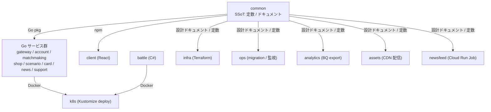

# システム全体設計

## 目次

- [概要](#概要)
- [プロジェクト構成](#プロジェクト構成multi-repo)
- [技術スタック](#技術スタック)
- [システムアーキテクチャ](#システムアーキテクチャ)

関連ドキュメント: [APPLICATION.md](APPLICATION.md) / [INFRASTRUCTURE.md](INFRASTRUCTURE.md) / [DATA_DESIGN.md](DATA_DESIGN.md)

---

## 概要

### プロジェクト概要

Overload Party は、クラウドインフラをテーマにした対戦型デジタルカードゲーム。2 人のプレイヤーがリアルタイムで対戦し、相手の Budget を 0 以下にすることを目指す。

### 主要要件

- **リアルタイム対戦**: 2人のプレイヤーが同時にプレイ
- **複雑な状態管理**: リアクティブ効果の解決、継続効果
- **強整合性**: ゲーム状態の厳密な管理
- **低レイテンシ**: 快適なゲーム体験
- **スケーラビリティ**: 多数の同時対戦に対応
- **クロスプラットフォーム**: iOS/Android対応

### 非機能要件

| 要件 | 目標値 |
|------|--------|
| レスポンスタイム | < 100ms (P95) |
| 同時接続数 | 10,000+ |
| 可用性 | 99.9% |
| データ整合性 | 100% |

---

## プロジェクト構成（Multi-repo）

Overload Party は複数の独立した Git リポジトリで構成される。`overload-party-common` がゲームデザイン・カードデータ・ドキュメントの Single Source of Truth（SSoT）となり、コード生成パイプラインで各リポに成果物を配布する。

バックエンドは 9 つのサービス（gateway / account / matchmaking / shop / scenario / card / battle / news / support）で構成され、Battle のみ C# / .NET 10、それ以外はすべて Go 1.25 である。ドメインごとに独立したリポジトリ・デプロイ単位を持たせ、変更リスクと責務を局所化する。

gateway は **型契約と transport を分離する原則** に従う。client が消費する型 (REST レスポンス / WS event) は各ドメインサービスが直接公開する。一方 client の通信先は常に gateway 1 つで、認証・WS hub・各サービスへのパススルーを担う。型を所有サービスに集約することで gateway 側の二重実装を排除し、入口を gateway に絞ることで認証と接続管理を中央化する。詳細は [ADR-036](../adr/036-gateway-passthrough-and-service-public-api.md)。

### リポジトリ一覧

| リポジトリ | 役割 | 技術 | CI |
|-----------|------|------|-----|
| **common** | ゲーム設計・カードデータ・ドキュメント（SSoT） | YAML, Python, Markdown | DB マイグレーション自動適用 |
| **gateway** | 認証（Firebase ID Token 検証・player_id 解決）・WS hub・各サービスへのパススルー・集約 API（クライアント単一入口） | Go 1.25, Gin, gorilla/websocket | lint → test → Docker push |
| **account** | ユーザー登録・設定・パスワードリセット | Go 1.25 | lint → test → Docker push |
| **matchmaking** | マッチキュー管理・マッチロジック・バトル引き渡し | Go 1.25 | lint → test → Docker push |
| **shop** | 課金連携 (Apple/Google)・購入管理・フラグ付与・Webhook 受信 | Go 1.25 | lint → test → Docker push |
| **scenario** | シナリオ解放判定・シナリオファイル配信 | Go 1.25 | lint → test → Docker push |
| **card** | カードマスターデータ管理・デッキバリデーション・カード一覧 | Go 1.25 | lint → test → Docker push |
| **battle** | 対戦ゲームエンジン | C# / .NET 10 | test → Docker push |
| **client** | モバイル/Web フロントエンド | React 19, TypeScript, Vite, Capacitor | lint → typecheck → test |
| **infra** | Google Cloud リソース管理 | Terraform | plan → apply（パス変更時のみ） |
| **k8s** | GKE デプロイ・運用 | Kustomize, GitHub Actions | deploy / startup / shutdown / scale |
| **ops** | DB マイグレーション・監視ジョブ | Docker, Cloud Run, Python | CI + 手動 dispatch |
| **analytics** | Spanner → BigQuery エクスポート | Go, Cloud Functions | 手動デプロイ |
| **newsfeed** | ニュース記事収集・要約（RSS → Gemini → Pub/Sub publish） | Python 3.12, Vertex AI, Upstash Redis | CI で自動デプロイ |
| **news** | 収集記事の校閲・配信（newsfeed から Pub/Sub 購読 → gateway 経由で配信） | Go 1.25, Gin, HTMX | 未整備 |
| **support** | お知らせ配信・問い合わせ受付（Slack / SendGrid 連携） | Go 1.25, Gin | 未整備 |
| **assets** | ゲームアセットパイプライン（イラスト・スタンプ・SE 等の管理・配信） | GCS, Cloudflare CDN | CI でマニフェスト生成 |
| **web** | ティザーサイト（未作成） | — | — |

**サービス間通信:** Gateway 以外のサービス（account / matchmaking / shop / scenario / card / battle / news / support）はクラスタ内ネットワークに閉じ、原則 Gateway からの内部 REST 経由でのみ到達可能とする。ドメインサービス間の連携は Pub/Sub に集約し、HTTP 直叩きは行わない。例外として scenario の onboarding 内 name 入力ステップと再開判定に限り scenario → account の直叩きを許容する（[ADR-025](../adr/025-onboarding-name-via-rest-and-cross-service-http.md)）。外部公開の例外は以下:

- **shop** の Webhook 受信エンドポイント（Apple / Google の課金サーバー通知受信用、詳細は [APPLICATION.md](APPLICATION.md) 参照）
- **support** の問い合わせ受付フォーム（CORS で Origin 制限）
- **news / support** の管理 UI（IAP で運用者認証）

### コード生成パイプライン

外部公開 API 契約の SSoT を **OpenAPI / AsyncAPI** に統一する。自前定義の YAML から OpenAPI / AsyncAPI に揃えることで、spec viewer / mock server / breaking change の差分検査 (`oasdiff` / `asyncapi-diff`) といった既成ツールをそのまま CI / 開発フローに組み込めるようになり、契約進化のリスクを機械的に検知できる。詳細な配布物・ツール選定は [ADR-034](../adr/034-api-contract-ssot-openapi-asyncapi-and-go-module-distribution.md) を参照。

ゲーム定数（`game-design-constants` / `game-logic-constants` 等）は OpenAPI スキーマで素直に表現できないため独自 YAML SSoT を維持する。ドキュメント生成は common の `packages/doc-tools` パッケージが提供する。

### リポジトリ間の依存グラフ



---

## 技術スタック

### フロントエンド

```
React + Capacitor (TypeScript)
├── React 19
├── WebSocket Client (native WebSocket API)
├── State Management (Zustand)
├── UI Framework (Tailwind CSS)
├── Animation (Framer Motion)
├── Audio (Howler.js)
└── Capacitor (iOS / Android ネイティブラッパー)
```

**選定理由:**
- MVPの開発速度を最優先
- クロスプラットフォーム対応（Web, iOS, Android）
- React エコシステムの豊富なライブラリ
- 将来的に演出面で不足があれば Unity への移行を検討

### バックエンド

バックエンドは Go サービス 8 本と C# の Battle Server 1 本の計 9 サービス構成。Gateway がクライアントからのトラフィックを受け、内部 REST でドメインサービスにルーティングする。

```
Go サービス群 (Go 1.25)
├── Web Framework (Gin)
├── WebSocket (gorilla/websocket) — gateway のみ
├── PostgreSQL Client (pgxpool)
├── Cloud SQL Auth Proxy (サイドカー)
└── Firebase Admin SDK — 認証検証が必要なサービス

Battle Server (C# / .NET 10)
├── ASP.NET Core (REST API)
├── PostgreSQL Client (Dapper)
├── Cloud SQL Auth Proxy (サイドカー)
└── xUnit (テスト)
```

**責務分離:**
- **gateway** (Go): 認証（Firebase ID Token 検証・player_id 解決）、WS hub、各ドメインサービスへの REST パススルー、集約 API
- **account** (Go): ユーザー登録・設定・パスワードリセット
- **matchmaking** (Go): マッチキュー管理、マッチロジック、バトルへの引き渡し
- **shop** (Go): 課金連携 (Apple/Google)、購入管理、フラグ付与、Webhook 受信
- **scenario** (Go): シナリオ解放判定、シナリオファイル配信
- **card** (Go): カードマスターデータ管理、デッキバリデーション、カード一覧
- **battle** (C#): ゲームエンジン、アクション処理、エフェクト、NPC AI、勝利判定、ゲームログ
- **news** (Go): 収集記事の校閲・配信
- **support** (Go): お知らせ配信・問い合わせ受付

**選定理由:**
- Gateway (Go): 高パフォーマンスな並行処理、WebSocket 常時接続に最適
- ドメインサービス (Go): Gateway と同じスタック (Go 1.25) で統一し、学習コスト・運用コストを抑える
- Battle (C#): 複雑なゲームロジックの表現力、型安全性、.NET エコシステム
- GKE Standard でゲームサーバー管理

### データベース

```
Cloud SQL PostgreSQL 16 (Regional: asia-northeast1)
├── 環境ごとに独立インスタンス (dev / stg / prod)
├── マシンタイプ: dev/stg: db-g1-small, prod: TBD
├── IAM DB 認証 (Cloud SQL Auth Proxy 経由)
├── JSONB による複雑な状態管理
└── Backup: Daily (prod)

Cloud Firestore (Native, asia-northeast1)
├── コレクション: game_config (運営チューニング可能な動的設定値の SSoT)
└── サービス横断 KV ストア。各サービスは公式 Firestore クライアントで読み取り
```

**選定理由:**
- Cloud SQL: ACID トランザクション + SELECT FOR UPDATE による行ロック / JSONB でゲーム状態を柔軟に格納 / Cloud SQL Auth Proxy + IAM 認証でセキュアな接続 / コスト効率 (Spanner 比 ~90% 削減)
- Firestore: スキーマ DDL 配布が不要な NoSQL KV ストアで、サービス横断の動的設定値を一元管理

### 認証

```
Firebase Authentication
├── Email/Password
└── Google Sign-In
```

### インフラ

```
Google Cloud (4プロジェクト構成)
├── keyandnotes-platform
│   ├── GKE Standard (全 9 サービス相乗り — 全環境共有)
│   │     e2-standard-2 (2 vCPU / 8 GiB) × 1 ノード
│   ├── Artifact Registry (Docker イメージ)
│   ├── Cloud Pub/Sub (matchmaking-events トピック)
│   └── Ingress (GCE L7 LB, gateway と shop のみ外部公開)
├── overload-party-{dev,stg,prod}
│   ├── Cloud SQL PostgreSQL (Database — 環境ごと独立、スキーマ単位分割)
│   ├── Cloud Storage (Replays, Logs)
│   └── Cloud Monitoring
```

### IaC・CI/CD

```
Infrastructure as Code
└── Terraform (`overload-party-infra` リポで管理)

CI: GitHub Actions
├── テスト・Lint
├── Docker イメージビルド
└── Artifact Registry プッシュ

CD: ArgoCD (GitOps)
├── deploy.yaml が main push でイメージを AR に push
├── ArgoCD Image Updater が k8s リポのマニフェストを更新
└── 人が ArgoCD UI で sync して環境反映 (全環境 manual sync)
```

---

## システムアーキテクチャ

### 全体構成図

```mermaid
graph TD
    subgraph Client
        app["React + Capacitor"]
    end

    subgraph Firebase
        auth["Firebase Auth"]
    end

    subgraph GKE["GKE (Application Layer)"]
        gw["gateway (Go)"]

        subgraph Domain Services
            account["account"]
            matchmaking["matchmaking"]
            shop["shop"]
            scenario["scenario"]
            card["card"]
            battle["battle (C#)"]
            news["news"]
            support["support"]
        end
    end

    newsfeed_job["newsfeed<br/>(Cloud Run Job)"]

    subgraph Pub/Sub Topics
        match_events["matchmaking-events"]
        onboarded_events["player-onboarded"]
        card_pack_purchased_events["card-pack-purchased"]
        faction_acquired_events["faction-acquired"]
        premium_events["premium-updated"]
        news_events["news-article-collected"]
    end

    subgraph Data
        db["Cloud SQL PostgreSQL"]
        redis["Upstash Redis"]
        firestore["Cloud Firestore<br/>(game_config)"]
    end

    subgraph Storage
        gcs_scenario["GCS<br/>(シナリオスクリプト)"]
        gcs_assets["GCS + CDN<br/>(ゲームアセット)"]
    end

    %% クライアント認証フロー
    app -->|"1. Firebase SDK でログイン"| auth
    auth -->|"2. ID トークン発行"| app
    app -->|"3. WS / REST<br/>(Authorization: Bearer)"| gw
    gw -->|"4. ID トークン検証"| auth

    %% Apple / Google → shop (webhook)
    apple_google["Apple / Google"] -->|"Webhook"| shop

    %% 外部 → support (問い合わせフォーム) / support → Slack, SendGrid
    user_form["問い合わせフォーム"] -->|"外部 REST<br/>(CORS)"| support
    support -->|"通知"| slack["Slack"]
    support -->|"受付メール"| sendgrid["SendGrid"]

    %% gateway → 各サービス (内部 REST)
    gw -->|内部 REST| account & matchmaking & shop & scenario & card & battle & news & support

    %% scenario → account: onboarding 内 name 確定 / 再開判定の REST 直叩き (ADR-025)
    scenario -->|"内部 REST<br/>(onboarding name / resume)"| account

    %% 各サービス → DB (Cloud SQL Auth Proxy sidecar 経由)
    account & card & shop & scenario & battle & gw & news & support -->|"Auth Proxy<br/>(sidecar)"| db

    %% matchmaking / newsfeed → Redis
    matchmaking --> redis
    newsfeed_job --> redis

    %% Firestore (game_config) — game_config を参照するサービスから読み取り
    account & shop & battle & scenario & gw -->|game_config 読み取り| firestore

    %% Pub/Sub: publish
    matchmaking -->|publish| match_events
    scenario -->|publish| onboarded_events
    shop -->|publish| card_pack_purchased_events
    shop -->|publish| faction_acquired_events
    shop -->|publish| premium_events
    newsfeed_job -->|publish| news_events

    %% Pub/Sub: subscribe
    match_events -->|subscribe| gw
    onboarded_events -->|subscribe| account & card
    card_pack_purchased_events -->|subscribe| card
    faction_acquired_events -->|subscribe| account
    premium_events -->|subscribe| account
    news_events -->|subscribe| news

    %% GCS
    scenario -->|スクリプト取得| gcs_scenario
    app -->|アセット取得| gcs_assets
```



**サーバー間通信:**
- サービス間は内部 REST API（クラスタ内ネットワーク）。Firebase ID Token 検証と player_id 解決は gateway が一元化し、各ドメインサービスは gateway が発行する HMAC 署名 JWT (`X-Internal-Auth`) を検証して player_id を取得する（[ADR-037](../adr/037-internal-auth-hmac-signed-jwt.md)、詳細は [APPLICATION.md §内部サービス間認証](APPLICATION.md#内部サービス間認証)）
- ドメインサービス間の連携は Pub/Sub に集約し、HTTP 直叩きは原則禁止。例外は scenario → account の onboarding 内 name 確定と再開判定のみ（[ADR-025](../adr/025-onboarding-name-via-rest-and-cross-service-http.md)）
- 外部公開は gateway（クライアント向け WS/REST）を主とし、例外は以下:
  - **shop** の Webhook 受信（Apple / Google の課金サーバー通知）
  - **support** の問い合わせ受付フォーム（CORS で Origin 制限）
  - **news / support** の管理 UI（IAP で運用者認証）
- マッチ成立通知: matchmaking → Cloud Pub/Sub `matchmaking-events` → gateway
- オンボーディング表示名確定: scenario → account 内部 REST `PUT /internal/v1/players/:playerId/name`（onboarding 内 name 入力ステップ。[ADR-025](../adr/025-onboarding-name-via-rest-and-cross-service-http.md)）
- オンボーディング完了 / 初期ファクション付与 / 初期パック配布: scenario → Cloud Pub/Sub `player-onboarded` → account / card ([ADR-022](../adr/022-faction-selected-decomposition.md))
- カードパック購入: shop → Cloud Pub/Sub `card-pack-purchased` → card（GrantPack で配布）（[ADR-031](../adr/031-shop-products-normalization-and-faction-purchased-decomposition.md), [ADR-032](../adr/032-card-pack-introduction-and-grant-unification.md)）
- ファクションアンロック: shop → Cloud Pub/Sub `faction-acquired` → account（player_factions INSERT）（[ADR-031](../adr/031-shop-products-normalization-and-faction-purchased-decomposition.md)）
- プレミアム状態更新: shop → Cloud Pub/Sub `premium-updated` → account
- ニュース記事収集: newsfeed (Cloud Run Job) → Cloud Pub/Sub `news-article-collected` → news
- DB 所有権はサービス単位に分離（DATA_DESIGN.md 参照）

### 通信フロー

#### ゲーム開始フロー

```
Client              Gateway Pod          Battle Pod           Cloud SQL
     │                    │                    │                    │
     │  1. Connect WS     │                    │                    │
     ├───────────────────>│                    │                    │
     │                    │                    │                    │
     │  2. Join Game      │                    │                    │
     ├───────────────────>│                    │                    │
     │                    │  3. GET state      │                    │
     │                    ├───────────────────>│                    │
     │                    │                    │  4. Read GameState │
     │                    │                    ├───────────────────>│
     │                    │                    │<───────────────────┤
     │                    │<───────────────────┤                    │
     │                    │                    │                    │
     │  5. GameState      │                    │                    │
     │<───────────────────┤                    │                    │
```

#### アクション実行フロー

```
Player A (Client)   Gateway Pod          Battle Pod           Cloud SQL      Player B (Client)
     │                    │                    │                    │                │
     │  1. Play Card      │                    │                    │                │
     ├───────────────────>│                    │                    │                │
     │                    │  2. POST action    │                    │                │
     │                    ├───────────────────>│                    │                │
     │                    │                    │  3. Validate +     │                │
     │                    │                    │     Update State   │                │
     │                    │                    ├───────────────────>│                │
     │                    │                    │<───────────────────┤                │
     │                    │                    │  4. Record Event   │                │
     │                    │                    ├───────────────────>│                │
     │                    │<───────────────────┤                    │                │
     │                    │                    │                    │                │
     │  5. State Update   │                    │                    │                │
     │  + available_actions│                   │                    │                │
     │  + turn_controls   │                    │                    │                │
     │<───────────────────┤────────────────────────────────────────────────────────>│
     │                    │  (WebSocket broadcast)                  │                │
```

> **Note:** `available_actions` は `my` の配下に含まれ、アクティブプレイヤーのみに送信される。
> カードに紐付かないゲームフロー制御（フェーズ終了、手札破棄）は `turn_controls` として別メッセージで送信。
> サーバーが毎状態更新時にフェーズごとの有効アクションを計算し送信することで、
> クライアント側にゲームロジックを重複して持たせない設計（Master Duel 方式）。
> 詳細は `API_REFERENCE.md` の `game_state` / `turn_controls` セクションを参照。
